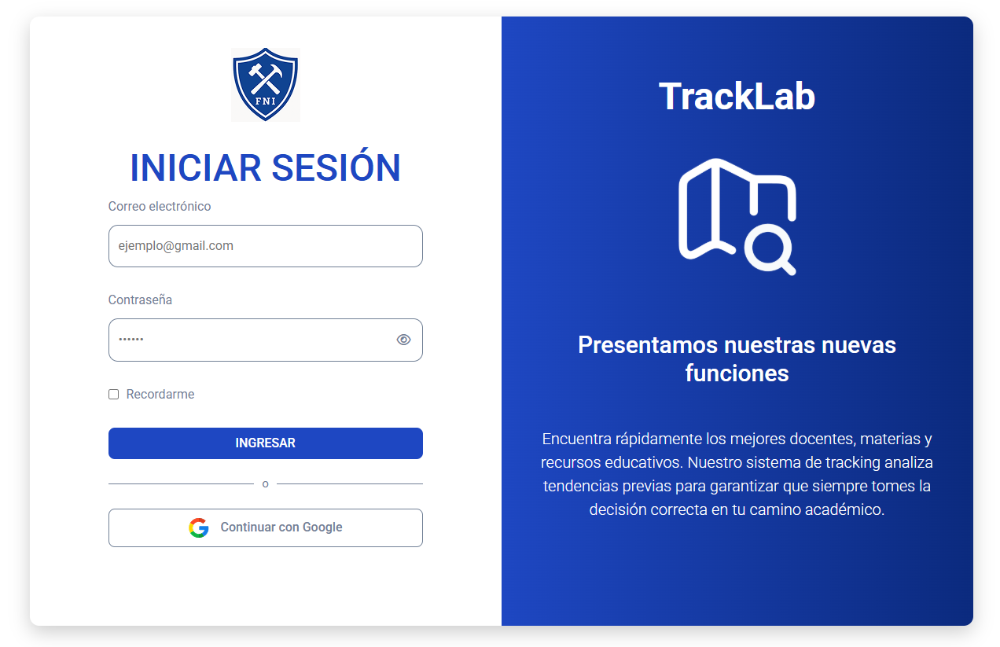
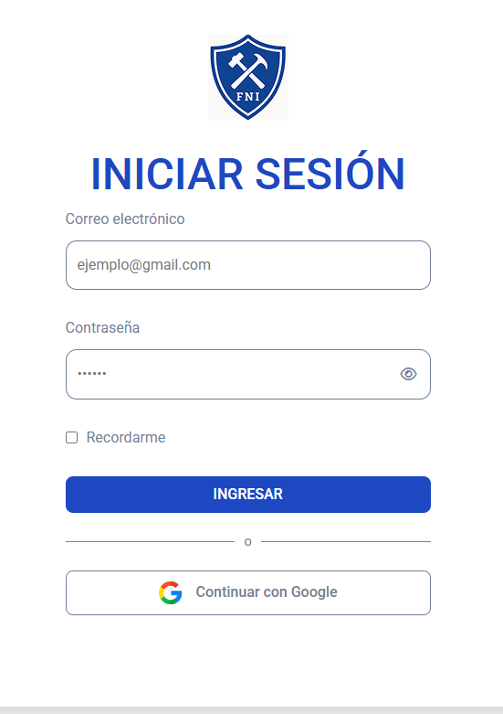

# TrackLab - Sistema de Seguimiento Académico

TrackLab es una plataforma que ayuda a los estudiantes a encontrar los mejores docentes, materias y recursos educativos. El sistema analiza tendencias previas para garantizar que los usuarios tomen las decisiones correctas en su camino académico.

## 📱 Mockups

### Versión Web



### Versión Móvil



## 🚀 Características

- Interfaz de inicio de sesión intuitiva
- Diseño responsive (adaptable a diferentes dispositivos)
- Opciones de autenticación múltiples (email/contraseña y Google)
- Funcionalidad de "Recordarme" para mantener la sesión
- Información visual atractiva sobre las características del producto

## 💻 Tecnologías Utilizadas

- HTML5
- CSS3
- Font Awesome (para iconos)
- Google Fonts (Roboto)

## 📂 Estructura del Proyecto

```
tracklab/
├── assets/
│   ├── icon.png
│   ├── iconGoogle.png
│   └── mapIcon.png
├── styles/
│   ├── components/
│   │   ├── button.css
│   │   └── form.css
│   ├── layout/
│   │   ├── login.css
│   │   └── info-panel.css
│   ├── reboot.css
│   └── init.css
└── index.html
```

## 🎨 Componentes Principales

### Formulario de Inicio de Sesión

- Campo de correo electrónico
- Campo de contraseña con opción para mostrar/ocultar
- Checkbox "Recordarme"
- Botón de inicio de sesión principal
- Opción alternativa para iniciar sesión con Google

### Panel Informativo

- Logo de TrackLab
- Ícono ilustrativo
- Título promocional
- Descripción de las características principales
- Diseño atractivo con gradiente azul

## 📱 Responsividad

El diseño se adapta a diferentes tamaños de pantalla:

- En pantallas grandes: diseño de dos columnas (formulario y panel informativo)
- En pantallas medianas (< 992px): solo se muestra el formulario de inicio de sesión
- En pantallas pequeñas (< 576px): ajustes adicionales para mejorar la usabilidad en móviles

## 🎨 Paleta de Colores

- Color Primario: `#1e47c2` (Azul)
- Color Primario Oscuro: `#0b2a7e`
- Color de Texto: `#718096` (Gris)
- Color Blanco: `#ffffff`

## 📝 Variables CSS

```css
:root {
  /* Variables de color */
  --color-primary: #1e47c2;
  --color-primary-dark: #0b2a7e;
  --color-white: #ffffff;
  --color-text: #718096;

  /* Variables tipográficas */
  --font-family-base: "Roboto", sans-serif;
}
```

## 🔧 Instalación

1. Clona este repositorio
2. Abre el archivo `index.html` en tu navegador

## 📚 Recursos Adicionales

- [Google Fonts - Roboto](https://fonts.google.com/specimen/Roboto)

## 📝 Notas de Desarrollo

El proyecto utiliza una arquitectura CSS modular con:

- CSS de reseteo (reboot.css)
- Variables y estilos base (init.css)
- Componentes reutilizables (button.css, form.css)
- Layouts específicos (login.css, info-panel.css)

Este enfoque facilita el mantenimiento y la escalabilidad del código.
